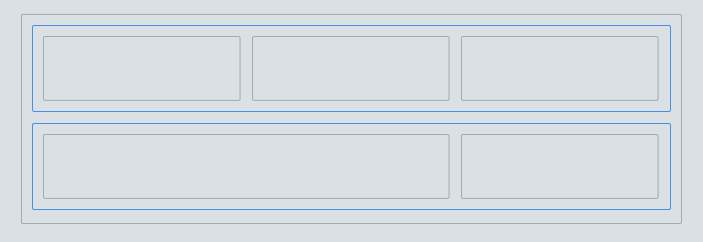
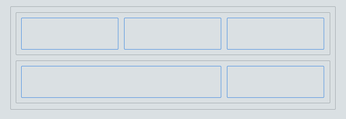
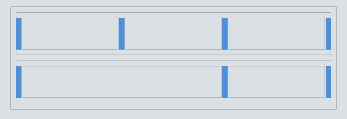

# MutaGrid

The modular, functional, clean, semantic, customizable & lightweight *grid-system* you'll ever find.

*What? Another one?*

But this one is **really** flexible. With proper configuration you can have a 2.9kb (min) fully-compatible *CSS grid-system*!

## Features

- Super customizable ✔
- Super lightweight ✔
- Functional: small, clear, easy to read ✔
- IE8+ ✔
- No need of CSS normalizer/reseter (but recommended) ✔✔
- 4 default mediaquery breakpoints ✔✔
- Open Source ♺

Still not convinced? Check out the next comparison table ↓

|                   | MutaGrid | Bootstrap 3 | Foundation 5 |
|------------------:|:--------:|:-----------:|:------------:|
|          **Size** | 15.5kb ✔ |    15.9kb   |    20.5kb    |
|    **Responsive** |   sure!  |     yes     |      yes     |
|   **Breakpoints** |     5    |      5      |       5      |
|       **Support** |   IE8+   |     IE8+    |     IE9+     |
| **Pre-processor** |   SCSS   |     Less    |     SCSS     |


**MutaGrid** is a *CSS grid-system* that uses classes to fit your needs of a rock-solid structure. It's not far from other main competitors like *Bootstrap* and/or *Foundation*, but **MutaGrid** was built from the ground up to support a flexible grid based in rows/columns and the exact utility classes needed. With that in mind, MutaGrid's size (minified) can be from 2.6kb (just the grid) up to 21.3kb (with full classes).


## Components


### Breakpoints

**MutaGrid** is a modern grid built for responsive layouts. This feature cannot be removed, only configured (see [Customize](#customize)). Default viewport breakpoints are:

#### xsmall
- default value: 480px (can be ignored if it is set to *false*)
- target: *smartphones*

#### small
- default value: 768px
- target: *phablets / tablets (portrait)*

#### medium
- default value: 1024px
- target: *desktop / laptop / tablet (landscape) browsers*

#### large
- default value: 1280px
- target: *desktop browsers*

#### xlarge
- default value: 1680px (can be ignored if it is set to *false*)
- target: *wide-screens, smart tv's*

For many **MutaGrid** components (columns, utility, auxiliar and classes) CSS classes are created for each breakpoint size, letting you use them to customize your layout as needed. 


### Containers

> CSS class: `.container`

> Responsive classes: *no*

A container will adopt the width defined for each breakpoint:

```scss
$containers: (
  xsmall:   100%,     // full width of screen
  small:    100%,     // full width of screen
  medium:   1024px,   // same as breakpoint
  large:    1280px,   // same as breakpoint
  xlarge:   1680px    // same as breakpoint
);
```

When certain breakpoint is reached, the container's width will adopt that size.


### Rows

> CSS class: `.row`

> Responsive classes: *no*

A row hold and wrap one or more columns and represent the vertical part of the structure. This class clears the whole width, so a new `.row` will take 100% width and set a new line break.




### Columns

> CSS class: `.column-#`
> 
> Responsive classes: 
> ```html
> .column-xsmall-#
> .column-small-#
> .column-medium-#
> .column-large-#
> .column-xlarge-#
> ```

Columns are the hearth of **MutaGrid** and define the horizontal sections of a layout. They depend directly of the total columns defined in `mutagrid.scss` (*default: 12 columns*):

```scss
$grid-columns: 12;
```



When `mutagrid.scss` is compiled, CSS class names are created for each `.column-#` calculating the width until the total of columns and width (100%) is reached. 

As example, the default *12 columns grid* generates the following CSS classes:

```css
.column-1   { width: 8.33333%;  }
.column-2   { width: 16.66667%; }
.column-3   { width: 25%;       }
.column-4   { width: 33.33333%; }
.column-5   { width: 41.66667%; }
.column-6   { width: 50%;       }
.column-7   { width: 58.33333%; }
.column-8   { width: 66.66667%; }
.column-9   { width: 75%;       }
.column-10  { width: 83.33333%; }
.column-11  { width: 91.66667%; }
.column-12  { width: 100%;      }
``` 

The same classes for a *5 columns grid*:

```css
.column-1 { width: 20%;  }
.column-2 { width: 40%;  }
.column-3 { width: 60%;  }
.column-4 { width: 80%;  }
.column-5 { width: 100%; }
```


### Gutter

> CSS class: `.gutter-*` (top | left | bottom | right)
> 
> Responsive classes: 
> ```html
> .gutter-*-xsmall
> .gutter-*-small
> .gutter-*-medium
> .gutter-*-large
> .gutter-*-xlarge
> ```

The *gutter* is the space between columns and by default it's value is 1em:

```scss
// Gutter Size
$gutter: 1em;
```



If you set `$gutter: 0;` columns will not have space between.


Extra-classes were added if you need to manually add gutter between elements:

```css
.gutter-top     { margin-top: 1em!important; }
.gutter-right   { padding-right: 1em!important; }
.gutter-bottom  { margin-bottom: 1em!important; }
.gutter-left    { padding-left: 1em!important; }
.no-gutter      { padding-left:0!important; padding-right:0!important; }
```


### Auxiliar Classes

As any other grid-system, **MutaGrid** includes *center, pull, push* and *offset* classes:

#### Center:

> CSS class: `.column-center`
> 
> Responsive classes: 
> ```html
> .column-center-xsmall
> .column-center-small
> .column-center-medium
> .column-center-large
> .column-center-xlarge
> ```

Centers a column within it's row. That simple.

```css
.column-center { float: none; margin-left: auto; margin-right: auto; }
```

```html
<div class="row">
  <div class="column-4 column-center"></div>
</div>
```


#### Offset:

> CSS class: `.column-offset-#`
> 
> Responsive classes: 
> ```css
> .column-offset-xsmall-#
> .column-offset-small-#
> .column-offset-medium-#
> .column-offset-large-#
> .column-offset-xlarge-#
> ```


```css
.column-offset-# { margin-left: #; }
```

```html
<div class="row">
  <div class="column-4 column-offset-2"></div>
</div>
```


#### Push:

> CSS class: `.column-push-#`
> 
> Responsive classes: 
> ```css
> .column-push-xsmall-#
> .column-push-small-#
> .column-push-medium-#
> .column-push-large-#
> .column-push-xlarge-#
> ```


```css
.column-push-# { left: #; }
```

```html
<div class="row">
  <div class="column-4 column-push-1"></div>
</div>
```


#### Pull:

> CSS class: `.column-pull-#`
> 
> Responsive classes: 
> ```css
> .column-pull-xsmall-#
> .column-pull-small-#
> .column-pull-medium-#
> .column-pull-large-#
> .column-pull-xlarge-#
> ```


```css
.column-pull-# { right: #; }
```

```html
<div class="row">
  <div class="column-4 column-pull-1"></div>
</div>
```


### Utility Classes

> CSS classes:
> ```css
> .-hidden
> .-invisible
> .-visible
> .-visible-inline
> .-visible-inlineblock
> ```
> 
> Responsive classes (xsmall | small | medium | large | xlarge)
> ```css
> .-hidden-*
> .-invisible-*
> .-visible-*
> .-visible-inline-*
> .-visible-inlineblock-*
> ```


Utility classes are useful when you need to handle visibility states for certain element at certain breakpoint.

```css
.-hidden              { display: none!important; }
.-invisible           { visibility: hidden; }
.-visible             { display: block!important; }
.-visible-inline      { display: inline!important; }
.-visible-inlineblock { display: inline-block!important; }
```


##Use

Include **MutaGrid** to your project and start building your HTML structure. The formula is simple: 

> If you choose a total of 12 columns, put inside a `.row` the ammount of `.columns-` needed and suffix them considering the sum is the total of columns.

Lets take the following image as example and create 2 rows: one with 3 columns and the other 2 columns:


As the total sum of columns must be 12, the first row will have 3 columns with `.column-4` each and the second row one column will be `.column-8` an the other one `column-4`:

```html
<div class="row">
  <div class="column-4">.column-4</div>
  <div class="column-4">.column-4</div>
  <div class="column-4">.column-4</div>
</div>
<div class="row">
  <div class="column-8">.column-8</div>
  <div class="column-4">.column-4</div>
</div>
```

For more examples, see [Demos](#demos) section.

---

> **MutaGrid** follow [MutableCSS](https://github.com/mutable-tools/MutableCSS) guidelines.

## Customize

**MutaGrid** is ready to use if you need a 12 column grid-system and utility classes. If you need a custom-made version you can compile it by yourself very easy, the recipe: *GruntJS* & *SCSS*.

The steps to build your own version of **MutaGrid** are:

1. Download/clone from GitHub.

2. Install *NodeJS* dependencies from the console: `$ npm install`

3. If you need Normalize.css and/or IE8 support, install the *JavaScript* libraries using: `$ bower install`

4. Open `mutagrid/src/mutagrid.scss` and edit the options to fill your needs:

```scss
// Grid Columns
$grid-columns: 12;

// Gutter Size
$gutter:    1em;

// Breakpoint Sizes
$breakpoints: (
  xsmall:   480px,    // values: 480px | false
  small:    768px,
  medium:   1024px,
  large:    1280px,
  xlarge:   1680px    // values: 1680px | false
);

// Container Sizes (when a breakpoint is reached)
$containers: (
  xsmall:   100%,     // full width of screen
  small:    100%,     // full width of screen
  medium:   1024px,   // same as breakpoint
  large:    1280px,   // same as breakpoint
  xlarge:   1680px    // same as breakpoint
);

// CSS Transition speed (if animated grid is used)
$transition:    .3s;  // value: time(s | ms)

// Include auxiliar-classes by default?
$auxiliar-classes:  true; // value: bool

// Include utility-classes by default?
$utility-classes:   true; // value: bool
```
**5.a** Compile-it: `$ grunt compile`

Your files will be created in: 
```
dist/mutagrid/mutagrid.css
dist/mutagrid/mutagrid.min.css

// optional but recommended
dist/mutagrid/libs/normalize.min.css
dist/mutagrid/libs/lt-ie-9.min.css
```

### Development

If you want to dig into MutaGrid's heart, follow steps **1** to **4** and then:

**5.b** Initialize & watch files: `$ grunt init && grunt`

**6** Edit files within `src/mutagrid/` and compile saving `src/mutagrid/mutagrid.scss`

Your files will reside in: 
```
dist/mutagrid/mutagrid.css
dist/mutagrid/mutagrid.min.css
```

For production-ready files, follow step *5.a*

## Demos

- [Grid: 12 columns](http://mutable-tools.github.io/MutaGrid/grid-12.html)
- [Grid: 5 columns](http://mutable-tools.github.io/MutaGrid/grid-5.html)
- [Template: Blog](http://mutable-tools.github.io/MutaGrid/template-blog.html)
- [Template: Dashboard](http://mutable-tools.github.io/MutaGrid/template-dashboard.html)
- [Template: Simple Landing Page](http://mutable-tools.github.io/MutaGrid/template-landing.html)
- [Template: One Page Landing](http://mutable-tools.github.io/MutaGrid/template-onepagelanding.html)
- [MutaGrid Utility Classes](http://mutable-tools.github.io/MutaGrid/utility-classes.html)

### Collaboration

TODO

### License

[MIT License](https://raw.githubusercontent.com/mutable-tools/MutaGrid/master/LICENSE) © Jorge Epuñan 2015
